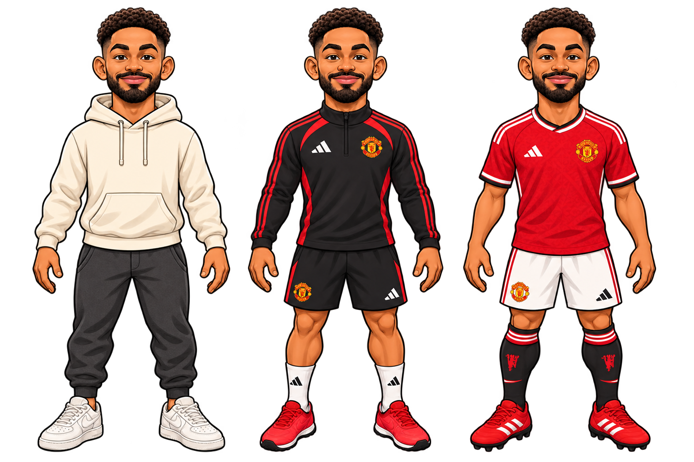

# Characters

The character section for the Manchester United animated documentary parody.
Every sheet lives under [`assets/characters/`](assets/characters/), one folder
per character.

## House style

The approved look is the **bold inked caricature** used for Matheus Cunha,
Bruno Fernandes and Michael Carrick. It has a big head on a compact body, thick
dark outlines, warm cel shading and a plain or transparent background, on a
1536 × 1024 sheet. Everything used on screen should match it.

Each character folder is laid out the same way:

| Location | What it holds |
|---|---|
| `outfits.png`, `face-visemes.png`, `movement.png` | The character's primary three sheets in the house style. Currently only Cunha, Bruno, Carrick and the four executives have these. |
| `house-style/` | Extra sheets that also match the house style, such as alternates, black-background versions and combined sheets. |
| `other-styles/` | Sheets drawn in a different style. Keep them for likeness, kit and pose reference, but **do not put them on screen next to house-style characters**. |

## Cast status

✅ means ready in the house style, 🟡 means partly in the house style, and ❌
means the character only has off-style art and needs a house-style redraw.

### Coaching staff and players

| Character | Status | House-style sheets | Off-style reference |
|---|---|---|---|
| Matheus Cunha | ✅ Style reference | [outfits](assets/characters/matheus-cunha/outfits.png) · [face-visemes](assets/characters/matheus-cunha/face-visemes.png) · [movement](assets/characters/matheus-cunha/movement.png) · [more](assets/characters/matheus-cunha/house-style/) | [other-styles](assets/characters/matheus-cunha/other-styles/) |
| Bruno Fernandes | ✅ | [outfits](assets/characters/bruno-fernandes/outfits.png) · [face-visemes](assets/characters/bruno-fernandes/face-visemes.png) · [movement](assets/characters/bruno-fernandes/movement.png) · [more](assets/characters/bruno-fernandes/house-style/) | [other-styles](assets/characters/bruno-fernandes/other-styles/) |
| Michael Carrick | ✅ | [outfits](assets/characters/michael-carrick/outfits.png) · [face-visemes](assets/characters/michael-carrick/face-visemes.png) · [movement](assets/characters/michael-carrick/movement.png) | [other-styles](assets/characters/michael-carrick/other-styles/) |
| Marcus Rashford | ✅ | [outfits](assets/characters/marcus-rashford/house-style/marcus-rashford__outfits__20260928T091455__2e768c7a.png) · [faces](assets/characters/marcus-rashford/house-style/marcus-rashford__faces-mouths-eyes__20260928T091457__88b99ae5.png) · [movement](assets/characters/marcus-rashford/house-style/marcus-rashford__movement-parts__20260928T091459__57e8fb17.png) | — |
| Kobbie Mainoo | ✅ | [outfits](assets/characters/kobbie-mainoo/house-style/kobbie-mainoo__outfits__20260928T091500__b46d99b6.png) · [players group](assets/characters/players-group/house-style/players-group__maguire-martinez-rashford-mainoo__20260929.png): heads, mouths, eyes, action poses | [other-styles](assets/characters/kobbie-mainoo/other-styles/): flat cartoon faces, lip-sync, turnaround |
| Benjamin Sesko | ❌ Closest to house style | — | [other-styles](assets/characters/benjamin-sesko/other-styles/): clean thin-line combined sheets |
| Harry Maguire | ✅ Players group sheet | [players group](assets/characters/players-group/house-style/players-group__maguire-martinez-rashford-mainoo__20260929.png): match kit, training, suit, 8 heads, mouths, eyes, action poses incl. back view | [other-styles](assets/characters/harry-maguire/other-styles/): flat cartoon, not used on screen |
| Luke Shaw | ❌ | — | [other-styles](assets/characters/luke-shaw/other-styles/): flat cartoon |
| Lisandro Martinez | ✅ Players group sheet | [players group](assets/characters/players-group/house-style/players-group__maguire-martinez-rashford-mainoo__20260929.png): match kit, training, 8 heads, mouths, eyes, action poses incl. back view | [other-styles](assets/characters/lisandro-martinez/other-styles/): flat cartoon, semi-realistic and photo collages |
| Matthijs de Ligt | ❌ | — | [other-styles](assets/characters/matthijs-de-ligt/other-styles/): semi-realistic |
| Senne Lammens | ❌ | — | [other-styles](assets/characters/senne-lammens/other-styles/): semi-realistic |
| Patrick Dorgu | ❌ | — | [other-styles](assets/characters/patrick-dorgu/other-styles/): semi-realistic, no action sheet |
| Ayden Heaven | ❌ | — | [other-styles](assets/characters/ayden-heaven/other-styles/): semi-realistic |
| Diogo Dalot | ❌ | — | [other-styles](assets/characters/diogo-dalot/other-styles/): semi-realistic, no action sheet |
| Harry Amass | ❌ | — | [other-styles](assets/characters/harry-amass/other-styles/): semi-realistic, no action sheet |
| Karl Darlow | ❌ | — | [other-styles](assets/characters/karl-darlow/other-styles/): semi-realistic, no body sheet |
| Leny Yoro | ❌ | — | [other-styles](assets/characters/leny-yoro/other-styles/): semi-realistic |
| Noussair Mazraoui | ❌ | — | [other-styles](assets/characters/noussair-mazraoui/other-styles/): semi-realistic |
| Tom Heaton | ❌ | — | [other-styles](assets/characters/tom-heaton/other-styles/): semi-realistic |
| Casemiro | ❌ Reference only | — | [other-styles](assets/characters/casemiro/other-styles/): photoreal collage |

The [players group sheet](assets/characters/players-group/house-style/players-group__maguire-martinez-rashford-mainoo__20260929.png) (Maguire, Martínez, Rashford, Mainoo) packs four players on one 1536 × 1024 page,
so its drawings are about half the size of the single-player sheets. Its transparency is cut slightly inside the
ink outline in places; `episode-1-not-ideal/parts.py` re-mattes it from the drawing (`ink` mode).

### Owners and executives

| Character | Status | House-style sheets |
|---|---|---|
| Jim Ratcliffe | ✅ | [outfits](assets/characters/jim-ratcliffe/outfits.png) · [face-visemes](assets/characters/jim-ratcliffe/face-visemes.png) · [movement](assets/characters/jim-ratcliffe/movement.png) |
| Avram Glazer | ✅ | [outfits](assets/characters/avram-glazer/outfits.png) · [face-visemes](assets/characters/avram-glazer/face-visemes.png) · [movement](assets/characters/avram-glazer/movement.png) |
| Joel Glazer | ✅ | [outfits](assets/characters/joel-glazer/outfits.png) · [face-visemes](assets/characters/joel-glazer/face-visemes.png) · [movement](assets/characters/joel-glazer/movement.png) |
| Omar Berrada | ✅ | [outfits](assets/characters/omar-berrada/outfits.png) · [face-visemes](assets/characters/omar-berrada/face-visemes.png) · [movement](assets/characters/omar-berrada/movement.png) |
| Jason Wilcox | ✅ | [outfits](assets/characters/jason-wilcox/house-style/jason-wilcox__outfits__20260928T154033__8b393c36.png) · [combined outfits, faces and actions](assets/characters/jason-wilcox/house-style/) |
| All four owners and executives | ✅ Group sheets | [owners-and-executives/house-style](assets/characters/owners-and-executives/house-style/): 10 four-person sheets |

The whole-squad cast collage in
[`manchester-united-cast-guide/other-styles/`](assets/characters/manchester-united-cast-guide/other-styles/)
is a photoreal line-up for reference only.

### Still missing

Bryan Mbeumo, Mason Mount, Shea Lacey, Joshua Zirkzee, Amad Diallo, Erling
Haaland, and the fictional physio, assistant coach and club staff member have no
sheets yet. [CHARACTER-CHECKLIST.md](CHARACTER-CHECKLIST.md) has the full
coverage notes and the wider planned cast.

## Making a character match

When redrawing an ❌ or 🟡 character, use their `other-styles/` sheets for
likeness, hair, kit number and poses. Then produce the standard three sheets in
the house style, matching the Cunha layout:

1. `outfits.png`: three full-body outfits side by side. Players wear home, then
   training, then match kit. Staff wear casual, then training, then suit.
2. `face-visemes.png`: front, three-quarter and profile heads; neutral, angry,
   happy, surprised and wink expressions; a row of mouth shapes; noses, brows
   and eyes.
3. `movement.png`: heads plus separate arms, legs and shoes for each outfit,
   ready for cutting and rigging.

Save them at the top level of the character's folder. Put any variants in
`house-style/`.

## Other files

- [CHARACTER-IMPORT.md](CHARACTER-IMPORT.md) lists every sheet per character
  with its original upload filename and a style label.
- [character-import-gallery.html](character-import-gallery.html) is a searchable
  local gallery. Search for `house` or `off-style` to filter it.
- [character-import-manifest.json](character-import-manifest.json) maps each
  source file to its image with checksums, dimensions and a `style` field.

All images are unmodified originals: nothing has been redrawn or retouched.
None of the sheets is a finished animation rig yet. Each still needs cutting,
pivots and viseme testing in a scene.
